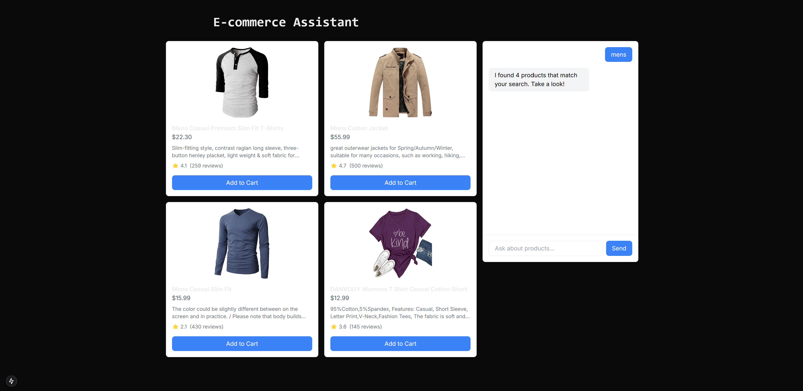

# E-commerce Chatbot with Next.js

A modern e-commerce chatbot interface built with Next.js, TypeScript, and Tailwind CSS. The chatbot helps users discover products from the Fake Store API through natural conversation.



## Features

- 🤖 Interactive chatbot interface
- 🔍 Real-time product search
- 📱 Responsive design (mobile & desktop)
- 🛍️ Product grid display with images
- ⭐ Product ratings and reviews
- 🎨 Modern UI with Tailwind CSS
- 💬 Smart greeting detection
- ⚡ Fast performance with Next.js 13+

## Prerequisites

Before you begin, ensure you have installed:
- Node.js 16.8 or later
- npm or yarn

## Getting Started

1. Clone the repository:
```bash
git clone https://github.com/your-username/ecommerce-chatbot.git
cd ecommerce-chatbot
```

2. Install dependencies:
```bash
npm install
# or
yarn install
```

3. Create `next.config.js` in the root directory:
```javascript
/** @type {import('next').NextConfig} */
const nextConfig = {
  images: {
    remotePatterns: [
      {
        protocol: 'https',
        hostname: 'fakestoreapi.com',
        pathname: '/**',
      },
    ],
  },
}

module.exports = nextConfig
```

4. Run the development server:
```bash
npm run dev
# or
yarn dev
```

5. Open [http://localhost:3000](http://localhost:3000) with your browser to see the result.

## Project Structure

```
src/
├── app/                    # Next.js app directory
│   ├── layout.tsx         # Root layout
│   └── page.tsx           # Home page
├── components/            # React components
│   ├── ChatBot.tsx       # Main chatbot component
│   ├── ChatMessage.tsx   # Individual chat message
│   ├── ProductCard.tsx   # Product display card
│   └── ProductGrid.tsx   # Product grid layout
└── lib/                  # Utilities and types
    └── types.ts          # TypeScript definitions
```

## Usage

1. Start typing in the chat input at the bottom of the chatbot interface
2. Use greetings like "hi", "hello", "hey" to start a conversation
3. Ask about products you're interested in
4. View product results in the grid on the left
5. Click on products to see more details

Example queries:
- "Show me men's clothing"
- "I'm looking for jewelry"
- "Do you have electronics?"
- "Search for women's clothing"

## Technologies Used

- [Next.js 13+](https://nextjs.org/)
- [TypeScript](https://www.typescriptlang.org/)
- [Tailwind CSS](https://tailwindcss.com/)
- [Fake Store API](https://fakestoreapi.com/)

## Contributing

1. Fork the repository
2. Create your feature branch (`git checkout -b feature/AmazingFeature`)
3. Commit your changes (`git commit -m 'Add some AmazingFeature'`)
4. Push to the branch (`git push origin feature/AmazingFeature`)
5. Open a Pull Request

## License

This project is licensed under the MIT License - see the [LICENSE.md](LICENSE.md) file for details.

## Acknowledgments

- [Fake Store API](https://fakestoreapi.com/) for providing the product data
- [Next.js](https://nextjs.org/) team for the amazing framework
- [Tailwind CSS](https://tailwindcss.com/) for the utility-first CSS framework

## Contact

Your Name - [@your_twitter](https://twitter.com/your_twitter)

Project Link: [https://github.com/your-username/ecommerce-chatbot](https://github.com/your-username/ecommerce-chatbot)